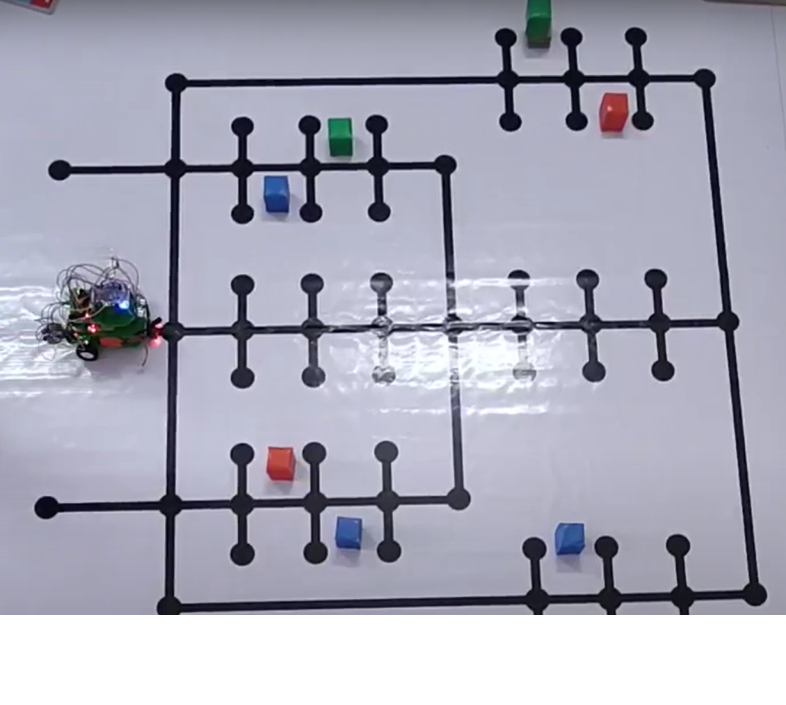

# Warehouse_management_using_FPGA_based_AGV
This project focuses on an automated robot with navigation and database capabilities to speed up work in a warehouse environment. 
In a practical scenario, a swarm of AGVs can be all controlled with a central GUI server with wireless communication capabilities to make an efficient warehouse management setup with minimal or no human intervention.

